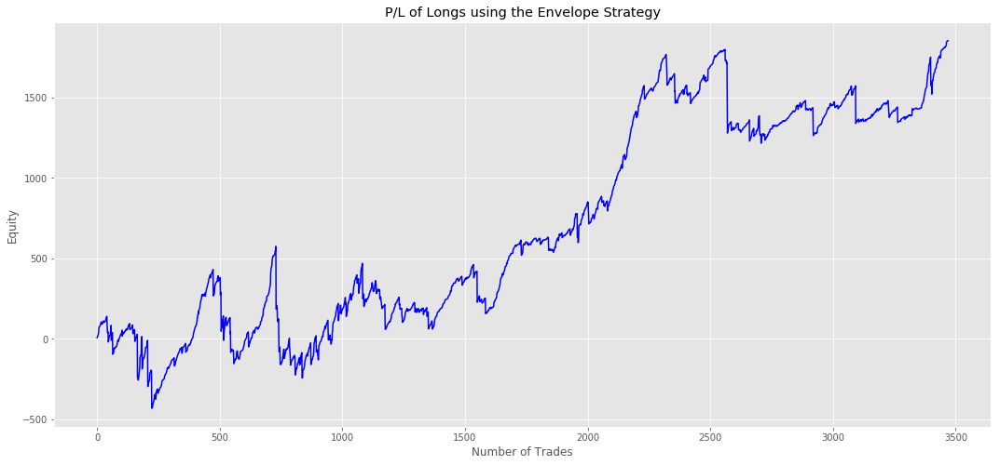
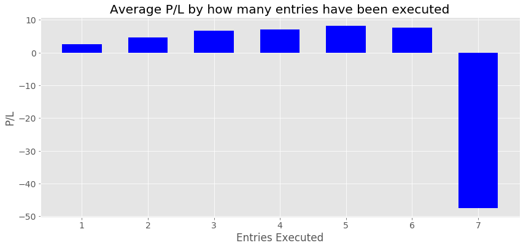
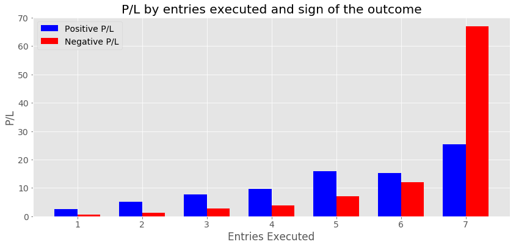

## Algorithmic Trading

This is a personal project to find strategies to "beat the market".

You can find several backtesting strategies, the first one uses the Envelopes strategy and the second one is a Moving Average reversion strategy.

## IPython Notebooks:

- [Moving Average Reversion Strategy](https://nbviewer.jupyter.org/github/vorsatti/Algo-Trading/blob/master/21%20vs%2061%20Moving%20Average%20Reversion%20Strategy.ipynb)
- [Envelope Strategy](https://nbviewer.jupyter.org/github/vorsatti/Algo-Trading/blob/master/Backtesting%20Envelopes%20Strategy.ipynb)

The Envelope strategy is the only one profitable so far. Below. you can see a graph of the results:

